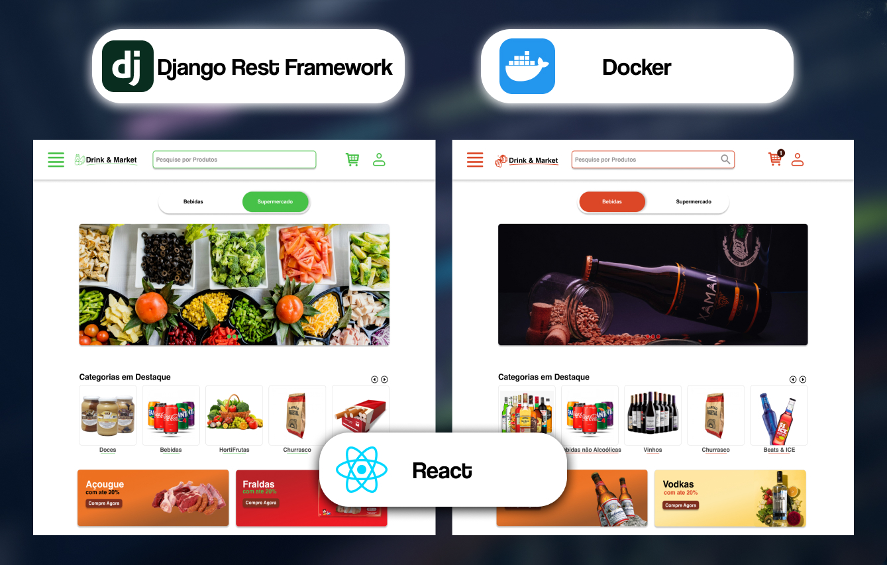

# Drink and Market Delivery

## 📚 Descrição

**Drink and Market Delivery** é um sistema de delivery de bebidas e produtos de mercado, inspirado no conceito da **anota.api**. Este projeto utiliza **Django REST Framework** para a criação de uma API robusta, **Docker** para gerenciar a aplicação e seu ambiente, e foi desenvolvido para aprimorar minhas habilidades em desenvolvimento backend com foco na criação de APIs escaláveis.

Além disso, desenvolvi um **design de interface** no Figma, apresentando a estrutura visual e funcional do sistema de delivery.

## 🎨 Design da Interface

A interface do usuário foi projetada no Figma para ilustrar a experiência visual do aplicativo. O design contempla a navegação pelo catálogo de produtos, seleção de bebidas e itens de mercado, carrinho de compras, e o processo de finalização de pedidos.

🔗 **[Acesse o design no Figma](https://www.figma.com/design/PcKdutrSk0Lk24yTO0Y0Qx/Projeto-inicial?node-id=303-2&t=V4Q4R83Ao8NbZ8Q9-1)**

## 🚀 Funcionalidades

- **Catálogo de Produtos**: Lista de bebidas e produtos de mercado disponíveis para entrega, com detalhes como preço, descrição e disponibilidade.
- **Carrinho de Compras**: Adicione ou remova produtos, atualize quantidades e visualize o preço total em tempo real.
- **Processamento de Pedidos**: Finalize compras com informações de entrega e métodos de pagamento integrados.
- **Autenticação de Usuários**: Login, registro e autenticação usando tokens JWT.
- **Gestão de Endereços**: Sistema de múltiplos endereços de entrega para cada usuário.

## 🛠️ Tecnologias Utilizadas

- **Django**
- **Django REST Framework**
- **PostgreSQL** como banco de dados
- **Docker** para contêinerização da aplicação
- **JWT** (JSON Web Tokens) para autenticação
- **Figma** para design da interface
